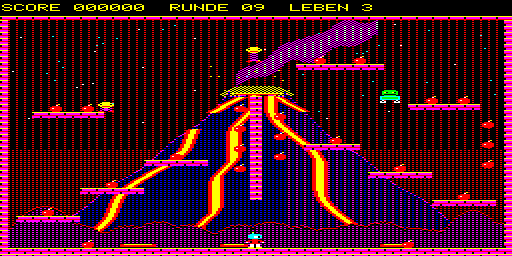
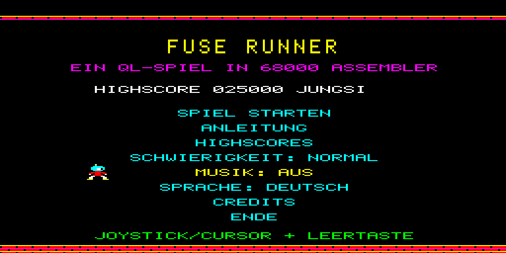
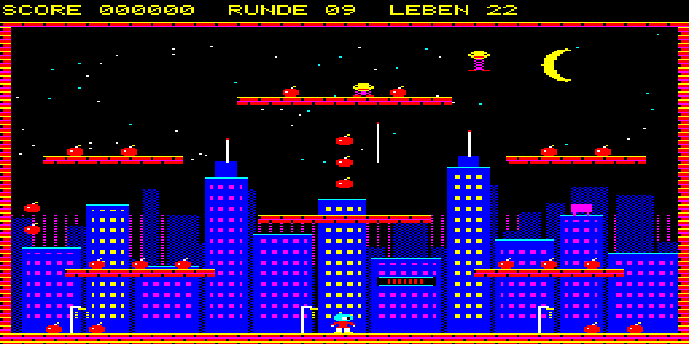
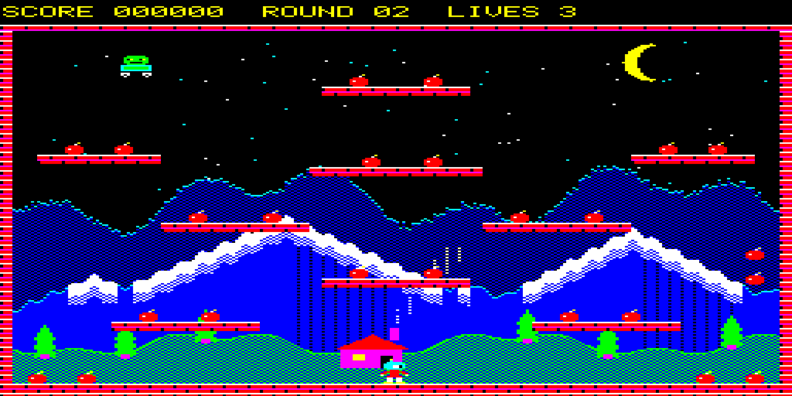
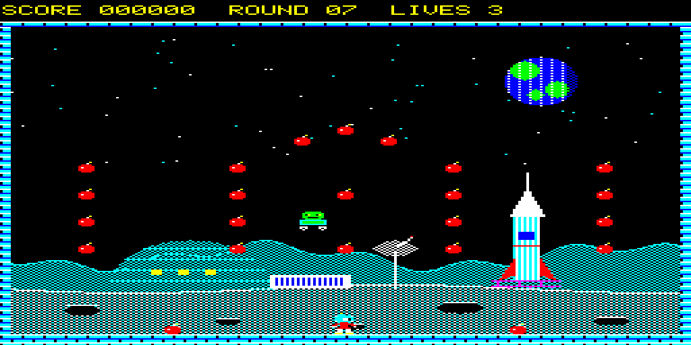

# FUSE RUNNER

**Ein Bomb-Jack-artiges Spiel für den Sinclair QL – komplett in 68000-Assembler.**
**A Bomb Jack style game for the Sinclair QL – written entirely in 68000 assembler.**



[Deutsch](#deutsch) · [English](#english)

---

## Deutsch

Sammle alle Bomben ein, bevor dich die Gegner erwischen! Nach der ersten Bombe brennt die nächste –
wer die brennenden Bomben der Reihe nach erwischt, bekommt am Rundenende Bonuspunkte.

- 9 Runden mit eigenen Hintergründen: Stadt, Berge, Wüste, Hafen, Burg, Wald, Mondbasis, Arktis, Vulkan –
  danach geht es schneller und mit mehr Gegnern von vorn los
- flüssige 25 Bilder/s im Mode 8 (256×256, 8 Farben) auf einem QL mit Originaltakt
- Bonus-Gegenstände (Extraleben, Frost, Explosion), Hüpfer ab Runde 5
- Titelmusik und Jingles, Highscore-Liste mit Speicherung, Modus „Leicht“
- Deutsch und Englisch, im Menü umschaltbar
- Tastatur, Joystick (CTL1/CTL2) und MiSTer-Gamepads

**Voraussetzungen:** Sinclair QL mit mindestens 256K RAM, oder ein Emulator bzw. MiSTer (RAM auf 640K stellen).

### Download

Die fertigen Spieldateien gibt es unter **[Releases](https://github.com/Jungsis-Corner/fuserunner/releases/latest)**
und auf **[itch.io](https://jungsi.itch.io/fuserunner)**:

- `fuserunner.win` – QXL.WIN-Image mit BOOT und Spiel für MiSTer, QPC2, Q-emuLator und QL-SD
- `fuserunner-v1.1.zip` (je Version eine eigene ZIP-Datei) – alle Spieldateien inklusive Anleitung (`LIESMICH_README.txt`)

Die ausführliche Anleitung zum Starten (auch auf dem MiSTer), zur Steuerung und zu den Spielregeln
steht in [LIESMICH_README.txt](LIESMICH_README.txt).

### Selbst bauen

```
cd src && ./make.sh      # braucht vasm, Python 3 (Pillow, numpy), für das WIN-Image qxltool (32 Bit)
```
`tools/setup_tools.sh` baut vasm, den Emulator sQLux und qxltool.

---

## English

Collect all bombs before the enemies get you! After the first bomb the next one lights up –
catch the lit bombs in order for a bonus at the end of the round.

- 9 rounds with their own backdrops: city, mountains, desert, harbour, castle, forest, moon base, arctic, volcano –
  then it starts over, faster and with more enemies
- smooth 25 frames/s in Mode 8 (256×256, 8 colours) on a QL at original speed
- bonus items (extra life, freeze, explosion), hoppers from round 5
- title music and jingles, saved high score table, easy mode
- German and English, switchable in the menu
- keyboard, joystick (CTL1/CTL2) and MiSTer gamepads

**Requirements:** Sinclair QL with at least 256K RAM, or an emulator / MiSTer (set RAM to 640K).

### Download

Get the ready-to-play files from **[Releases](https://github.com/Jungsis-Corner/fuserunner/releases/latest)**
or on **[itch.io](https://jungsi.itch.io/fuserunner)**:

- `fuserunner.win` – QXL.WIN image with BOOT and game for MiSTer, QPC2, Q-emuLator and QL-SD
- `fuserunner-v1.1.zip` (one ZIP per version) – all game files including the manual (`LIESMICH_README.txt`)

How to start the game (including MiSTer), controls and rules are described in
[LIESMICH_README.txt](LIESMICH_README.txt) (English part below the German one).

### Building

```
cd src && ./make.sh      # needs vasm, Python 3 (Pillow, numpy), qxltool (32 bit) for the WIN image
```
`tools/setup_tools.sh` builds vasm, the sQLux emulator and qxltool.

---

## Screenshots

| | |
|---|---|
|  |  |
|  |  |

---

Idee / Idea: Jungsi · Code: Claude & Jungsi · **[www.jungsi.de](https://www.jungsi.de)**

Lizenz / License: [MIT](LICENSE)
